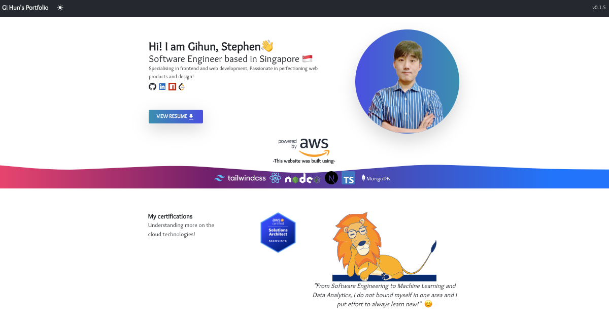

# My Portfolio Website

This project is my first web development project using ReactJS, to enhance my frontend development skills. The project is mainly based on using ReactJS with Typescript for client development, NodeJS for backend development.

Figure 1. Application Screenshot

This website mainly showcases my development work throughout my studies, with project scope varying topics such as Artificial Intelligence, Software Engineering, IoT, and many more.

## Web Application Architecture

Figure 2. Application Architecture

As shown on the figure 2 above, project application mainly consists of three different components:
1. NoSQL (MongoDB) for storing project data
1. Backend Server (NodeJS) for handling API fetch requests
1. Client Application (ReactJS + TS) to display relevant information
